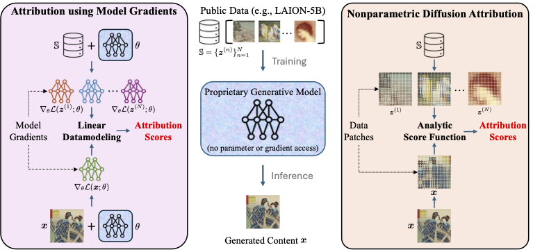

# Nonparametric Data Attribution for Diffusion Models (NDA)

This repository contains the official implementation for the paper **"[Nonparametric Data Attribution for Diffusion Models]"**, accepted by **ICML 2026**.

\[[arXiv](https://www.arxiv.org/abs/2510.14269)\]
---
## Overview

<p align="center">
  
</p>


---

## Getting Started

To run the experiments, you'll need to set up the appropriate environment.

1.  **Clone the Repository:**

    ```bash
    git clone https://github.com/sail-sg/NDA.git
    ```

2.  **Create a Conda Environment:**

    ```bash
    conda create -n nda python=3.9 -y
    conda activate nda
    ```

3.  **Install Dependencies:**

    ```bash
    pip install -r requirements.txt
    ```
---

## Reproducing Experiments

We provide commands for running experiments on CIFAR-2. And it can be easily transfered to other datasets.

1.  **Navigate to the Dataset Directory:**

    ```bash
    cd CIFAR2
    ```

2.  **Prepare the Dataset:**
    Run the `00_EDA.ipynb` notebook to generate the CIFAR2 dataset and prepare the necessary subsets for LDS.

3.  **Train the Diffusion Model:**
    Use the provided script to train a diffusion model.

    ```bash
    bash scripts/run_train.sh 0 18888 5000-0.5
    ```

4.  **Generate Images:**
    After training, generate images using:

    ```bash
    bash scripts/run_gen.sh 0 0 5000-0.5
    ```

5. **Compute Attribution Score:**
    Use the following scripts to compute attribution scores on either the **generated set** (`gen`)
or the **validation set** (`val`).

**Key Parameters**

- **`t_fixed`**: diffusion timestep, e.g., `100/200/300/400/500`.
- **`patch_size`**: patch size for original scale.
- **`topk`**: keep only top-K patches for each image.
- **Downscale / Two-scale only**:
  - **`patch_size_down`** and **`alpha`**: the downscaled patch size and the ratio between single-scale weight and downscaled weight.
- **`gen_source`**: choose `gen` or `val`.
- **`mask_value`**: penalty for invalid patch locations.
- **`kernel_batch_size`**: controls **GPU memory footprint**—*larger values are faster but use more VRAM; smaller values reduce memory usage at the cost of speed*. Tune up to the largest value that does not cause OOM on your GPU.

    ```bash
    bash scripts/run_score_orig.sh 0 5000-0.5 0 1000 100 7 100 gen 10 64
    bash scripts/run_score_orig.sh 0 5000-0.5 0 1000 100 7 100 val 10 64
    bash scripts/run_score_downscale.sh 0 5000-0.5 0 1000 100 14 100 gen 10 64
    bash scripts/run_score_downscale.sh 0 5000-0.5 0 1000 100 14 100 val 10 64
    bash scripts/run_score_twoscale.sh 0 5000-0.5 0 1000 100 14 100 10 0.5 gen 10 64
    bash scripts/run_score_twoscale.sh 0 5000-0.5 0 1000 100 14 100 10 0.5 val 10 64
    ```


6. **LDS Benchmark**

    Train 64 models corresponding to 64 subsets of the training set.

    ```
    bash scripts/run_lds_val_sub.sh 0 18888 5000-0.5 0 63
    ```

    Evaluate the model outputs on the validation set

    ```
    bash scripts/run_eval_lds_val_sub.sh 0 0 5000-0.5 idx_val.pkl 0 63
    bash scripts/run_eval_lds_val_sub.sh 0 1 5000-0.5 idx_val.pkl 0 63
    bash scripts/run_eval_lds_val_sub.sh 0 2 5000-0.5 idx_val.pkl 0 63
    ```

    Evaluate the model outputs on the generation set

    ```
    bash scripts/run_eval_lds_val_sub.sh 0 0 5000-0.5 idx_gen.pkl 0 63
    bash scripts/run_eval_lds_val_sub.sh 0 1 5000-0.5 idx_gen.pkl 0 63
    bash scripts/run_eval_lds_val_sub.sh 0 2 5000-0.5 idx_gen.pkl 0 63
    ```

8. **Evaluate the LDS scores**
    Run notebooks in evaluation:

    - [CIFAR2/evaluation/lds_gen.ipynb](CIFAR2/evaluation/lds_gen.ipynb)
    - [CIFAR2/evaluation/lds_val.ipynb](CIFAR2/evaluation/lds_val.ipynb)

---

## Citation

If you find this project useful in your research, please consider citing our paper:

```bibtex
@article{zhao2025nonparametricdataattributiondiffusion,
  title={Nonparametric Data Attribution for Diffusion Models},
  author={Yutian Zhao and Chao Du and Xiaosen Zheng and Tianyu Pang and Min Lin},
  journal={arXiv preprint arXiv:2510.14269},
  year={2025}
}
```

---

## Acknowledgement

This repository is partially adapted from the official implementation of [Intriguing Properties of Data Attribution on Diffusion Models](https://sail-sg.github.io/D-TRAK). We thank the authors for making their code and LDS dataset available ([Code Link](https://github.com/sail-sg/D-TRAK)).
